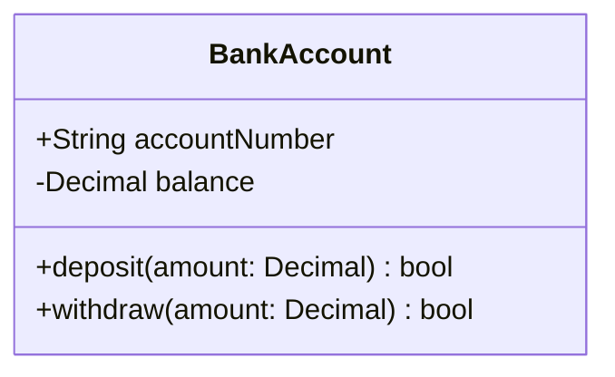
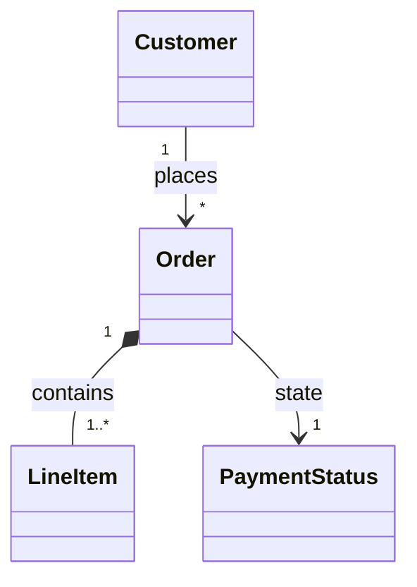
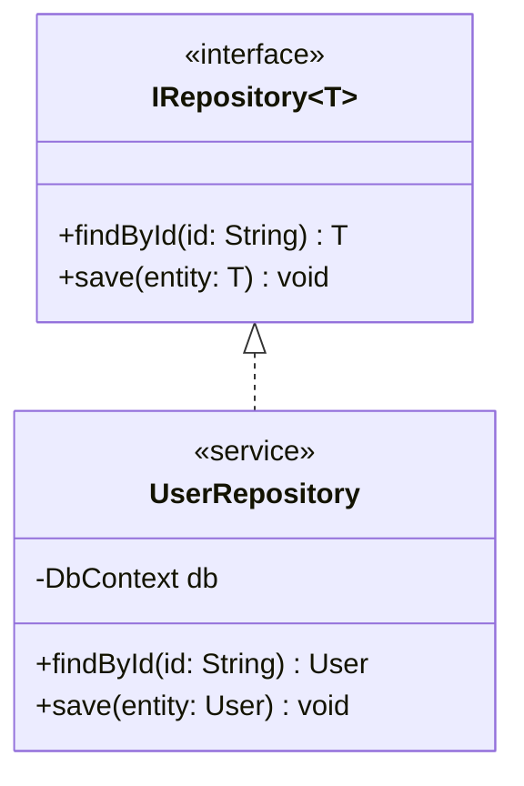
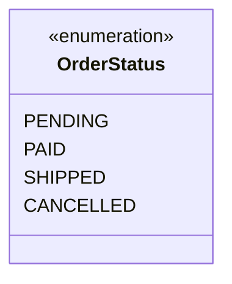

# Class Diagram Syntax Reference

Class diagrams model object-oriented software structures, classes, interfaces, attributes, methods, and relationships.

## 1. Declaration

Start with `classDiagram`:

## 2. Members & Visibility

Prefix attribute and method names with visibility indicators:
- `+` Public
- `-` Private
- `#` Protected
- `~` Package / Internal
- Classifier suffixes:
  - `*` Abstract: `+render()* void`
  - `$` Static: `+createId()$ String`

## 3. Relationships

| Syntax | Relationship | Meaning |
|---|---|---|
| `<|--` | Inheritance / Generalization | `Animal <|-- Duck` |
| `<\|..` | Implementation / Realization | `ILogger <|.. ConsoleLogger` |
| `*--` | Composition (strong ownership) | `Order *-- OrderItem` |
| `o--` | Aggregation (weak ownership) | `Department o-- Employee` |
| `-->` | Association / Directed | `Controller --> Service` |
| `..>` | Dependency | `ReportService ..> PdfGenerator` |
| `--` | Link / Solid line | `User -- Profile` |
| `..` | Link / Dashed line | `NodeA .. NodeB` |

### Multiplicity & Labels
Add cardinality and labels:

## 4. Interfaces, Annotations & Generics

Common annotations: `<<interface>>`, `<<abstract>>`, `<<service>>`, `<<enumeration>>`.

### Enumerations

## 5. Rules & Gotchas for Static HTML / `htmlLabels: false`

- Generic types: Use `~T~` syntax (e.g., `List~String~`, `IRepository~User~`). Do not use raw angle brackets `<T>` directly on class names as they trigger XML/HTML parsing errors.
- Annotations: Always wrap in `<<` and `>>`, e.g., `<<interface>>`.
- Method signatures: Wrap complex types in quotes if they contain commas or brackets.
- Do not use HTML formatting tags.
