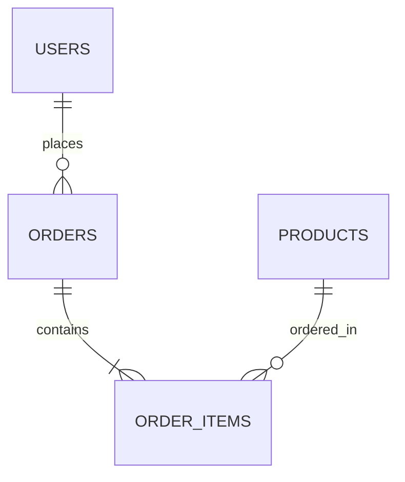
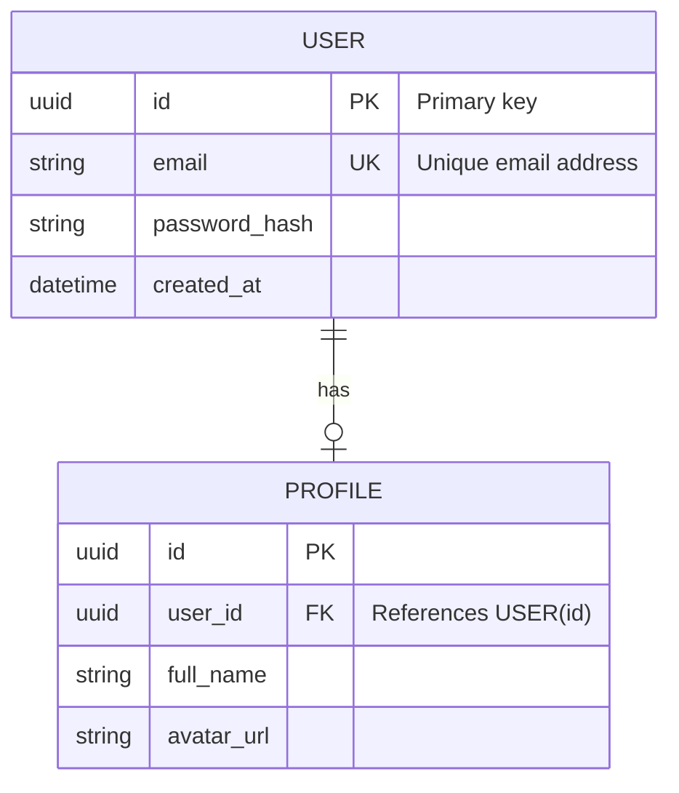
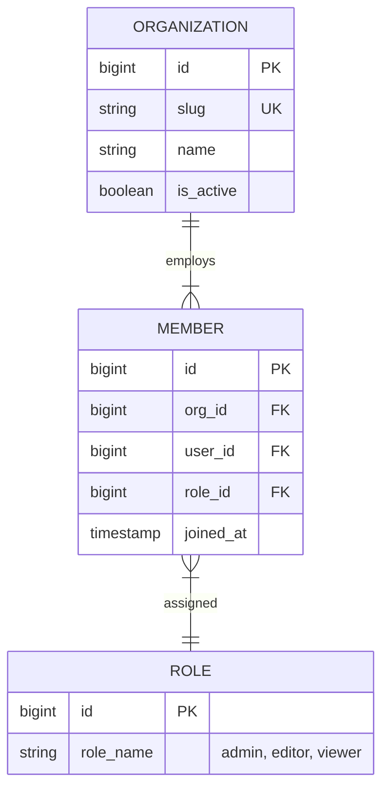

# Entity Relationship (ER) Diagram Syntax Reference

ER diagrams visualize relational database schemas, tables, fields, keys, and cardinality.

## 1. Declaration

Start with `erDiagram`:

## 2. Cardinality Connectors

Cardinality specifies the quantity relationship between two entities:

| Syntax | Left Side | Right Side | Meaning |
|---|---|---|---|
| `\|o--o\|` | Zero or one | Zero or one | Optional one-to-one |
| `\|\|--\|\|` | Exactly one | Exactly one | Mandatory one-to-one |
| `\|o--o{` | Zero or one | Zero or more | Optional one-to-many |
| `\|\|--o{` | Exactly one | Zero or more | Mandatory one-to-many |
| `\|\|--\|{` | Exactly one | One or more | Mandatory one-to-at-least-one |
| `}o--o{` | Zero or more | Zero or more | Many-to-many |

Cardinality markers:
- `|o`: Zero or one
- `||`: Exactly one
- `}o`: Zero or more
- `}|`: One or more

## 3. Entity Attributes & Keys

Define table columns with data types, column names, key constraints, and comments:

### Supported Keys
- `PK`: Primary Key
- `FK`: Foreign Key
- `UK`: Unique Key

## 4. Complex Relationships & Comments

## 5. Rules & Gotchas for Static HTML / `htmlLabels: false`

- Keep entity names uppercase or PascalCase (`USER`, `OrderItem`) without spaces.
- Datatypes should be standard alphanumeric (`string`, `uuid`, `int`, `datetime`, `boolean`). Avoid spaces in datatypes (use `varchar_255` instead of `varchar(255)`).
- Relationship labels (e.g. `: places`) should not contain punctuation or spaces unless enclosed in quotes.
- Wrap attribute comments in double quotes: `uuid id PK "Primary key"`.
