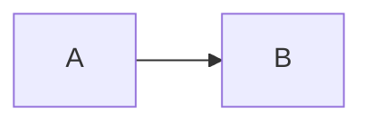
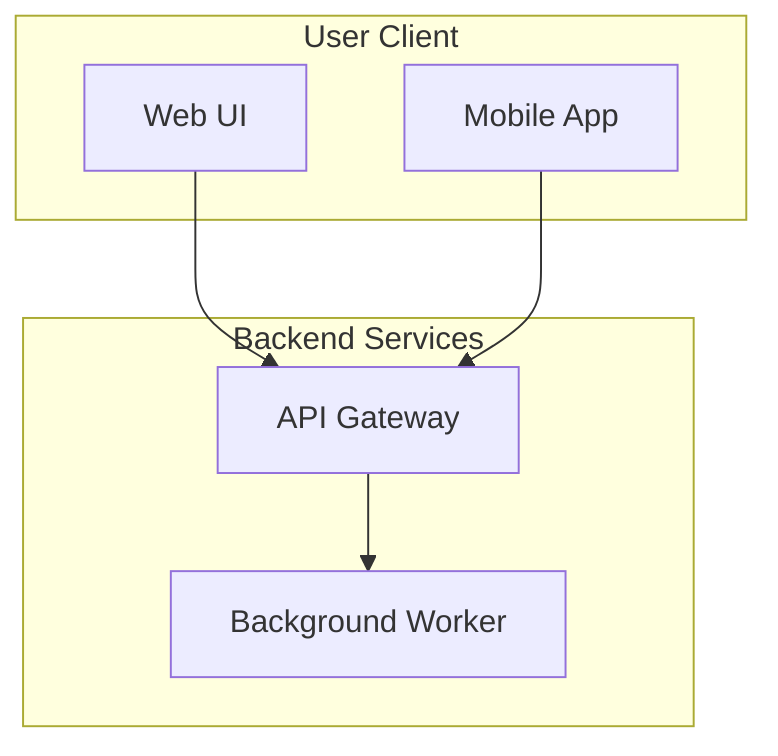
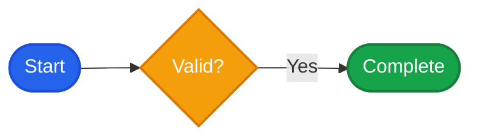

# Flowchart Syntax Reference

Flowcharts visualize processes, workflows, pipelines, and architecture layouts.

## 1. Direction & Declaration

Always begin with `flowchart` (preferred over legacy `graph`):
- `flowchart TD` (Top-down) or `flowchart TB`
- `flowchart LR` (Left-to-right)
- `flowchart BT` (Bottom-to-top)
- `flowchart RL` (Right-to-left)



## 2. Node Shapes

| Shape | Syntax | Example |
|---|---|---|
| Rectangle (default) | `id[Text]` | `A[Start]` |
| Rounded box | `id(Text)` | `B(Processing)` |
| Stadium / Pill | `id([Text])` | `C([Terminal Node])` |
| Subroutine | `id[[Text]]` | `D[[Call Function]]` |
| Cylindrical / Database | `id[(Text)]` | `E[(Postgres DB)]` |
| Circle | `id((Text))` | `F((Status))` |
| Asymmetric / Flag | `id>Text]` | `G>Notification]` |
| Rhombus / Decision | `id{Text}` | `H{Is Valid?}` |
| Hexagon | `id{{Text}}` | `I{{Preparation}}` |
| Parallelogram | `id[/Text/]` | `J[/Input/]` |
| Trapezoid | `id[/Text\]` | `K[/Step 1\]` |
| Double circle | `id(((Text)))` | `L(((End Status)))` |

## 3. Links & Connectors

| Link Type | Normal | With Text |
|---|---|---|
| Solid arrow | `A --> B` | `A -->|Yes| B` or `A -- Yes --> B` |
| Open link | `A --- B` | `A ---|Label| B` or `A -- Label --- B` |
| Dotted arrow | `A -.-> B` | `A -.->|Async| B` or `A -. Async .-> B` |
| Dotted line | `A -.- B` | `A -.-|Note| B` |
| Thick arrow | `A ==> B` | `A ==>|Heavy| B` or `A == Heavy ==> B` |
| Multi-directional | `A <--> B` | `A <-->|Sync| B` |

## 4. Subgraphs & Groups

Subgraphs group related nodes into bounded containers:



## 5. Styling

Define reusable styles using `classDef`:



### Always set `color` together with `fill`

The page ships a light and a dark theme. When a `classDef` or `style` sets `fill`
but no `color`, Mermaid paints the label with the theme text color, which is dark
in light mode and light in dark mode. A light pastel fill then gets a light label
in dark mode and the text disappears.

```mermaid
flowchart LR
    %% wrong: fill without color, label unreadable in dark mode
    classDef bad fill:#dbeafe,stroke:#1d4ed8;
    %% right: explicit label color that works in both themes
    classDef good fill:#dbeafe,stroke:#1d4ed8,color:#0f172a;
```

Pair every fill with a label color that contrasts at least 4.5:1:

| Fill | Label color |
|---|---|
| Light pastel (`#dbeafe`, `#dcfce7`, `#fef3c7`) | `#0f172a` |
| Saturated dark (`#2563eb`, `#16a34a`, `#0d9488`) | `#ffffff` |
| Neutral light (`#f1f5f9`, `#ffffff`) | `#0f172a` |

A dark fill such as `#2563eb` is fine as long as its label is light: the fill stays
dark in both themes, so `color:#ffffff` is readable everywhere.

The `assemble.mjs` script warns when a `fill` has no `color`, when a fill/label pair
falls below 4.5:1, and when a dark fill would be unreadable in light mode. The page
also corrects unreadable labels at render time, but fix the source instead of
relying on that safety net.

## 6. Rules & Gotchas for Static HTML / `htmlLabels: false`

- **Line breaks:** DO NOT use `<br>` or `<br/>`. Use literal quoted multiline strings:
  ```mermaid
  flowchart TD
      A["First Line
Second Line"]
  ```
- **Special characters:** Always wrap labels in double quotes if they contain parentheses, colons, brackets, or math symbols:
  `Node["Order (status: pending)"]`
- **Reserved words:** Avoid node IDs like `end`, `subgraph`, `graph`, `style`, `class`. If needed, use `n_end["end"]`.
- **Node IDs:** Keep node IDs alphanumeric and simple (`nodeA`, `svc_auth`, `db_main`). Put human-readable text inside brackets.
