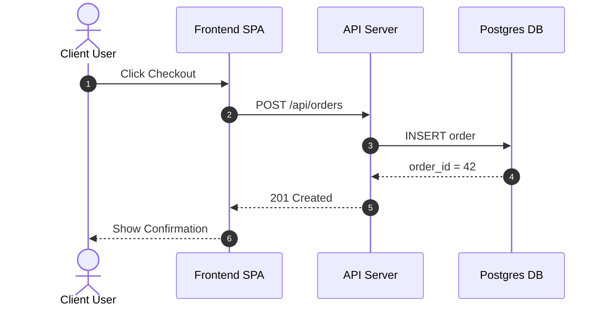
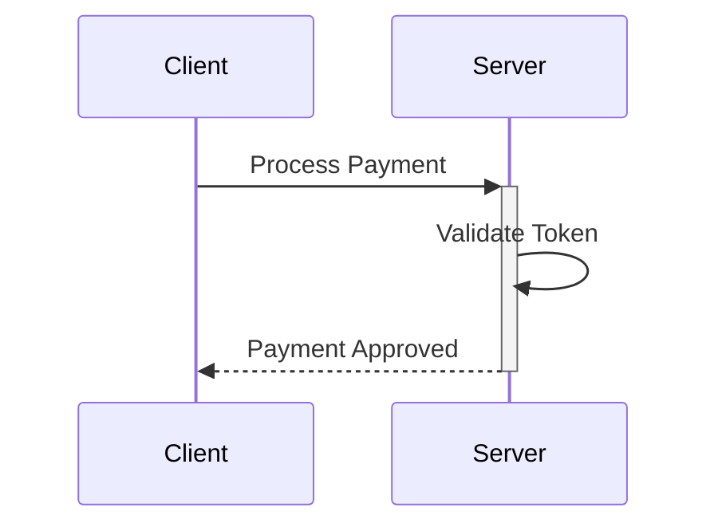
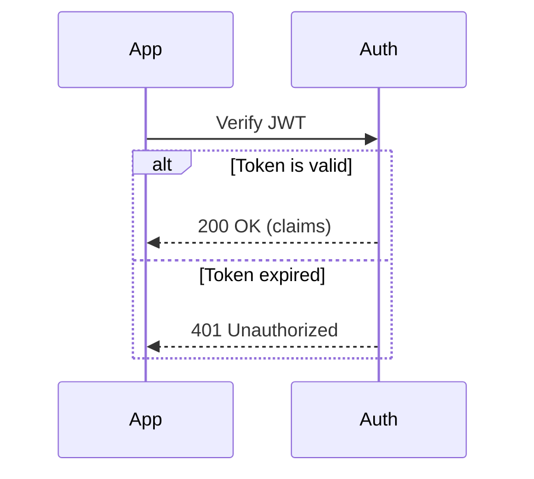
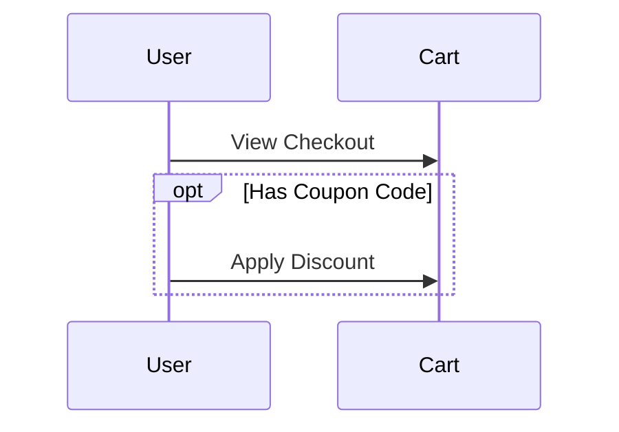
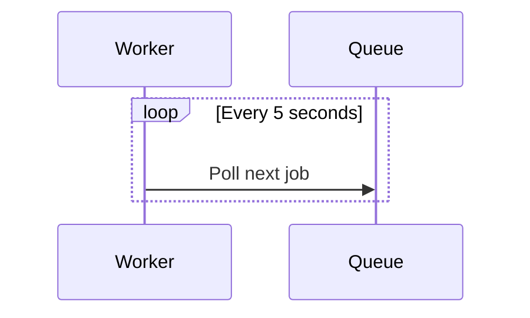
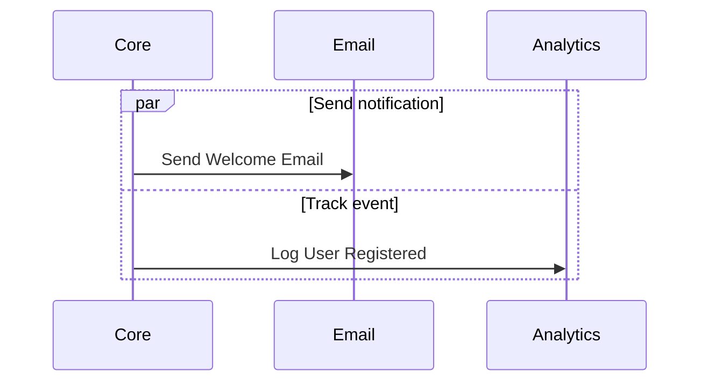
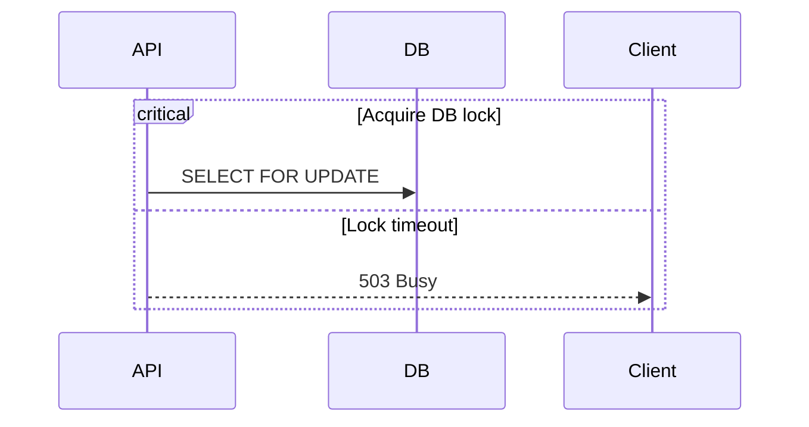

# Sequence Diagram Syntax Reference

Sequence diagrams model sequential interactions, communications, and message exchanges over time.

## 1. Declaration & Participants

Start with `sequenceDiagram`:



- `actor` displays a human silhouette icon.
- `participant` displays a rectangular box.
- Aliasing: `participant <id> as <Display Name>`
- `autonumber`: automatically numbers each interaction step.

## 2. Message Arrows

| Arrow Syntax | Type / Meaning |
|---|---|
| `A->B: msg` | Solid line without arrow |
| `A->>B: msg` | Solid line with arrowhead (synchronous request) |
| `A-->B: msg` | Dotted line without arrow |
| `A-->>B: msg` | Dotted line with arrowhead (asynchronous reply / response) |
| `A-x B: msg` | Solid line with cross at end (lost / failed message) |
| `A--x B: msg` | Dotted line with cross at end |
| `A-) B: msg` | Solid line with open arrow (async fire-and-forget) |
| `A--) B: msg` | Dotted line with open arrow |

## 3. Activations (Lifelines)

Show when a participant is actively processing:
- Explicit: `activate API` and `deactivate API`
- Shortcut on messages: `User->>+API: Request` (activate) and `API-->>-User: Response` (deactivate)



## 4. Control Structures & Blocks

### Alt / Else (Conditionals)


### Opt (Optional)


### Loop (Repetition)


### Par (Parallel flows)


### Critical / Option


## 5. Notes & Annotations

- Over a single participant: `Note left of App: Cached response` or `Note right of DB: Write ahead log`
- Spanning multiple participants: `Note over App,API: HTTPS / TLS 1.3 encrypted`

## 6. Rules & Gotchas for Static HTML / `htmlLabels: false`

- Do not use HTML tags (`<br>`, `<b>`). For line breaks in message text or notes, use newline within quotes:
  ```mermaid
  sequenceDiagram
      Client->>Server: "POST /login
  Content-Type: application/json"
  ```
- Keep participant IDs identifier-friendly (`User`, `API_Gateway`, `AuthService`).
- Avoid colon `:` inside message text without wrapping in quotes.
