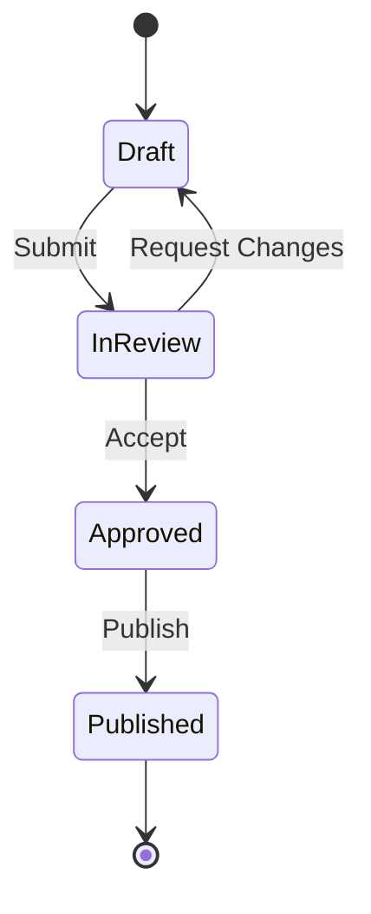
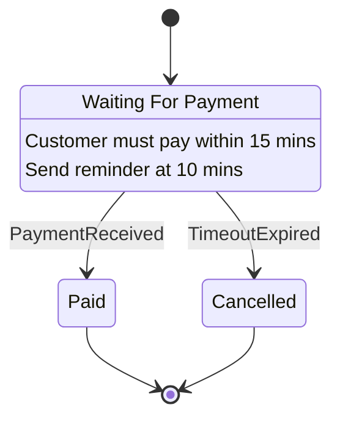
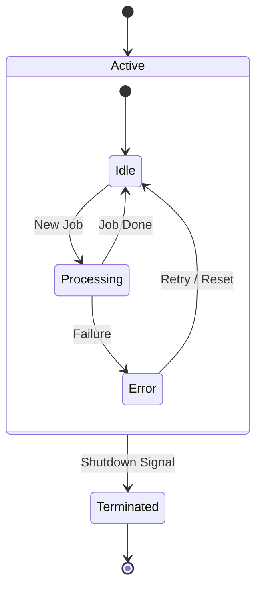
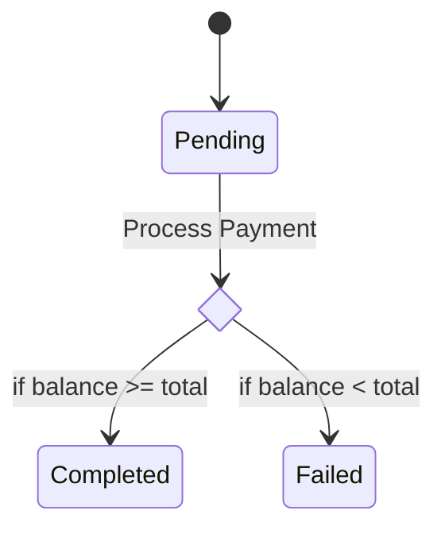
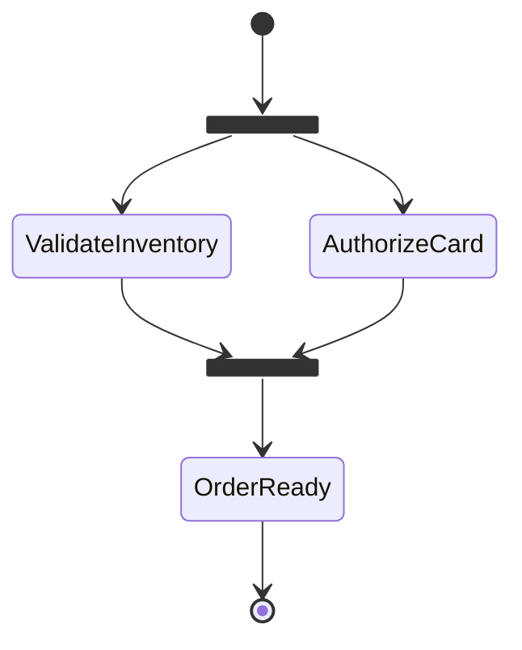
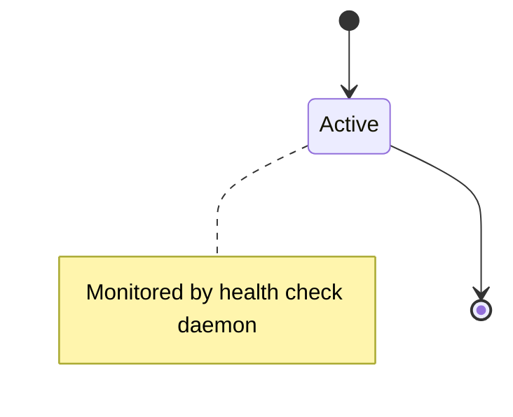

# State Diagram Syntax Reference

State diagrams model the finite state machines, entity lifecycles, and state transitions of a system.

## 1. Declaration

Always declare using `stateDiagram-v2` (version 2 provides enhanced layout and styling over legacy `stateDiagram`):

- `[*]` represents the initial state or terminal state.
- Transition syntax: `StateA --> StateB: Transition Event / Action`

## 2. Descriptions and Labels

Add descriptions to states using a colon `:`:

## 3. Composite (Nested) States

Group nested states into parent states:

## 4. Choice, Fork & Join

### Choice Pseudo-state (Decisions)

### Fork & Join (Concurrency)

## 5. Notes

- `note right of StateName: Note text`
- `note left of StateName: Note text`

## 6. Rules & Gotchas for Static HTML / `htmlLabels: false`

- Always use `stateDiagram-v2`.
- When state names have spaces, define an alias: `state "Long State Name" as StateAlias`.
- Do not use ` ` in transition labels or descriptions. Use standard quoted newlines if multiline is required.
